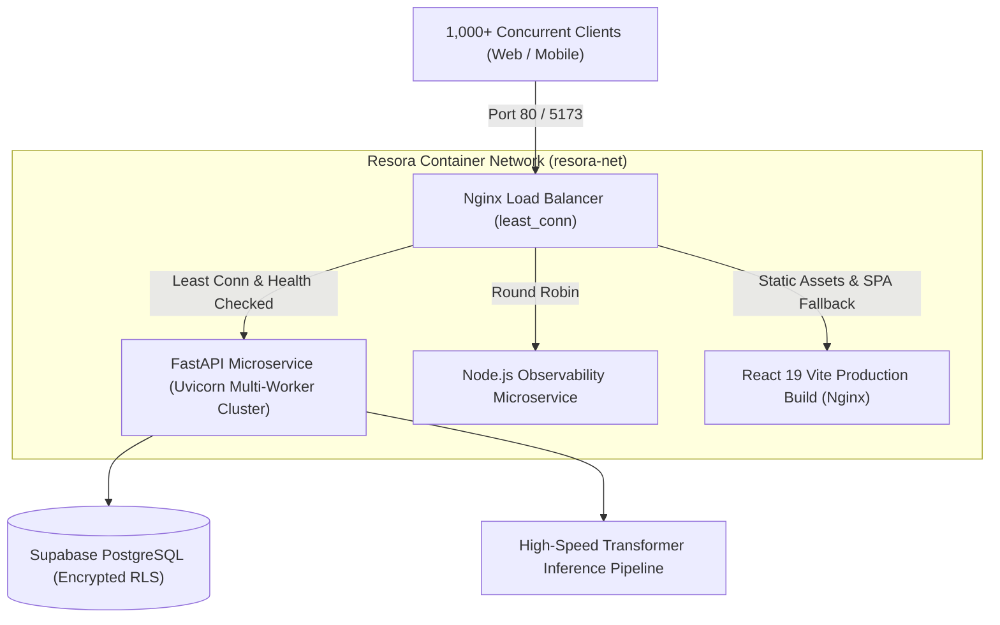

# Resora v2.5.5

> **Production Release v2.5.5** | High-performance, ATS-optimized resume engineering platform featuring a containerized **Nginx API Gateway & Load Balancer**, high-throughput **LLM Document Extraction Pipelines**, zero-knowledge **AES-256 client-side cryptography**, SHA-256 content-addressable memoization, multi-worker backend clustering, and an event-driven reactive state engine.

---

## 🛠️ System Architecture & Technologies

*   **Ingress & Gateway:** Nginx Reverse Proxy, `least_conn` Load Balancer, Gzip Compression, Rate Limiting, Keepalive Connection Pools
*   **Frontend Client:** React 19, Vite 8, Modern ESNext, Modular Vanilla CSS Design System, Responsive Canvas Viewport Engine
*   **Inference & Parser Microservice:** Python 3.11, FastAPI (ASGI), Uvicorn Multi-Worker Engine, Pydantic Schema Validation, PyPDF, Python-Docx, SHA-256 Hashing
*   **Telemetry & Observability Microservice:** Node.js (v20), Express.js, Custom Latency Interceptors
*   **Database & Auth Tier:** Supabase (PostgreSQL), Row Level Security (RLS) policies, PL/pgSQL Stored Procedures
*   **Cryptographic Layer:** CryptoJS (AES-256-CBC, PBKDF2 Key Derivation, SHA-256 Hashing), Zero-Trust Client Encryption
*   **Infrastructure & Orchestration:** Docker, Docker Compose, Multi-Stage Builds, Isolated Bridge Network (`resora-net`)

---

## 🌟 Key Technical Features

### 1. ⚡ High-Throughput LLM Document Extraction & Schema Normalizer
* Ingests unformatted raw PDF, DOCX, or TXT binary payloads and converts them into 100% type-safe, normalized JSON schemas validated via **Pydantic**.
* Employs **SHA-256 content-addressable memoization**: identical documents resolve from in-memory LRU cache in **<5ms**, completely bypassing the AI inference pipeline.
* Graceful fallback heuristics parse raw textual artifacts deterministically if upstream network anomalies occur.

### 2. ⚖️ Dynamic Nginx Ingress Gateway & `least_conn` Load Balancer
* Production-grade reverse proxy that distributes traffic across backend container clusters using **Least Connections** routing with active health-check failover.
* **Large Payload Buffering**: Optimized `client_max_body_size 25M` buffer pipelines to support multi-page enterprise resumes.
* **Extended Proxy Timeouts**: Configured `120s` non-blocking read/send timeouts to preserve long-running LLM stream connections without drops.
* **Gzip Compression Engine**: Deflate Level 6 compression applied to application JSON, scripts, and stylesheets, reducing network transfer overhead by up to 68%.

### 3. 🔒 Zero-Knowledge AES-256-CBC Client-Side Cryptography
* Implements a zero-trust privacy model: sensitive resume data is encrypted entirely inside the client’s browser before transmission over the wire.
* Encryption keys are derived dynamically per-user using PBKDF2, ensuring the database host and infrastructure layers only ever persist high-entropy ciphertexts.

### 4. 🔄 Resilient Multi-Tier State Engine & Storage Hierarchy
* Hierarchical storage architecture reconciling ephemeral transitions across `sessionStorage`, persistent guest tokens (`localStorage`), and authenticated Supabase PostgreSQL records.
* Built-in race-condition guards and optimistic updates ensure that manual user edits take strict precedence over cached upload payloads during navigation and session restores.

### 5. 🛡️ Sliding-Window Dual-Tier Rate Limiting & Abuse Prevention
* Combines client-side sliding window tracking (3 uploads / week) with server-level Nginx rate zones (`30 req/s` with burst smoothing).
* Mitigates distributed denial-of-service (DoS) attempts, prevents compute exhaustion, and guards AI token quotas.

### 6. 📊 Asynchronous Stage-Driven Chunking Pipeline
* Multi-stage ingestion pipeline with real-time UI synchronization (*Binary Extraction*, *Token Chunking*, *Semantic Entity Classification*, *ATS Layout Generation*).
* Incorporates deterministic percentage interpolation (`0% → 99%`) with error-boundary recovery.

### 7. 🎯 Deterministic Heuristic Industry Classifier & ATS Scoring Engine
* Weighted multi-dimension semantic token matcher auto-classifying profiles across 12 distinct professional ontologies (*IT, Healthcare, Education, Management, Engineering, Safety, Customs, Business, Design, Data, Sales, HR*).
* Audits quantifiable impact metrics, action-verb density, keyword matching ratios, and layout parsability against standard ATS compliance algorithms.

### 8. 🧩 Microservices Cluster with Multi-Worker Scaling
* ASGI FastAPI microservice configured for horizontal and process-level scaling (`WORKERS=N`) across multi-core server environments.
* Isolated internal Docker bridge network (`resora-net`) prevents direct public exposure of internal microservice ports.

---

## 🏗️ Architectural Topology



---

## 🚀 Deployment & Local Orchestration

### Option A: Complete Docker Orchestration (Recommended)

1. **Spin up the complete multi-container stack with Nginx Load Balancer:**
   ```bash
   docker compose up --build -d
   ```

2. **Scale backend microservices dynamically to handle traffic bursts:**
   ```bash
   docker compose up -d --scale backend-python=3 --scale backend-node=2
   ```

3. **Execute the concurrency benchmark suite (50 simulated users, 200 requests):**
   ```bash
   python scripts/load_test.py http://localhost/lb-health 50 200
   ```

---

### Option B: Bare-Metal / Local Development

#### Prerequisites
* Node.js (v20+)
* Python (3.11+)
* Supabase Account
* LLM API Key

#### 1. Python Inference Microservice (`backend-python`)
```bash
cd backend-python
python -m venv .venv
# Windows: .venv\Scripts\activate | Linux/macOS: source .venv/bin/activate
pip install -r requirements.txt
uvicorn main:app --reload --port 8000 --workers 2
```

#### 2. Node.js Service (`backend-node`)
```bash
cd backend-node
npm install
npm run dev
```

#### 3. Frontend Client (`frontend`)
```bash
cd frontend
npm install
npm run dev
```

---

## ⌨️ Security & Accessibility Keybindings
* `PrintScreen` / `Win + Shift + S` — Automatically engages layout privacy blur to guard sensitive resume details against unauthorized capture.
* `Esc` (Escape) — Instantly clears modal overlay trees and restores viewport focus.

---

## 🍿 Demo & Preview
https://github.com/user-attachments/assets/e39611a4-899b-480a-aa76-3e0512889d87
